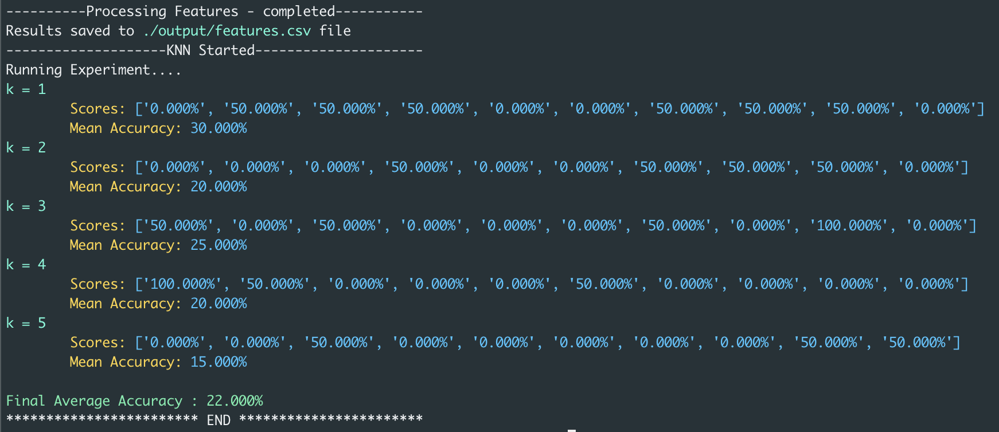

# Image Analysis - Part3

## Overview


The objective of the program is to classify the images to their cell-appropriate types (cyl, inter, let, mod, para, super, or svar). Below are the series of steps performed on the images 
* Take cell images as input. 
* Extract Features and save them to CSV file
* Load the CSV feature file data for k nearest neighbor
* Execute k-nearest neighbor on the loaded dataset with k-fold cross-validation, outputting the accuracy of cross-validation
* A TOML file for configuration of attributes input, output, k-bound, and number of folds

The operations are performed with ```numpy``` and not used any existing third-party library implementations.

## Usage

```
git clone https://github.com/praveenarallabandi/ImageFeatures.git
cd ImageFeatures
pip3 install --user pipenv
python ImageAnalysisPart3.py
```

## Implementation

### Feature Extraction 

The feature extracted from images are
* Area of cluster - The area of the image by calculating pixels of a cluster on the morphologically opened image
* Entropy of image - Probability of each image combined with a single scalar value
* Histogram Mean - Mean of the histogram on each of the occurrences of each pixel value
* Perimeter - The perimeter of the image by summation of the interior and external boundaries of the image 

The features are calcuated for each image, data normalized and concatenated with label name as last column and then saved to CSV file

### K-Nearest Neighbour
The testing is performed with k-fold(default to 10) cross validation. Each of the fold of 10 folds that test dataset is feed through knn for it's predicted labele against the testing protion of the fold. In a nutshell for each test instance

* Compute the diatance consistently of every training instance using ```euclidean distance```
* select the closest k instances and their frequent labeled class as predicted for the testrow

## Dependencies 

* numpy - For Array operations
* toml - Configuration settings
* PIL (Image) - Used only for importing and exporting images

## Results

Below is a sample of what the results reported from the cross fold validation for different values of k. The results obtained on the dataset seemed to indicate that the features extracted from the images weren't distinguishable enough to classify the cells as their respective type. Test on more values of k didn't seem to improve the results of the classification. 

* The range for the mean accuracies between k values around 20% to 30% with toal average accuracy at 22% for 21 images 



* The range for the mean accuracies between k values around 20% to 30% with toal average accuracy at 22% for 21 images 