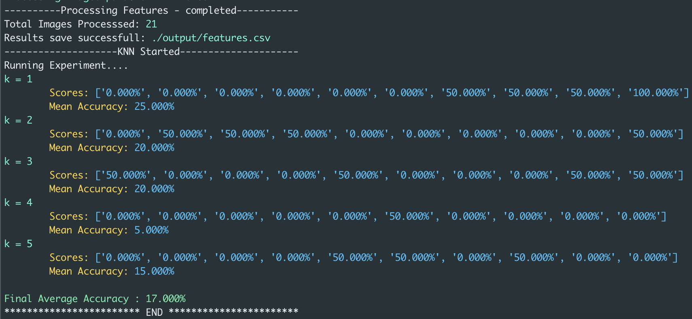
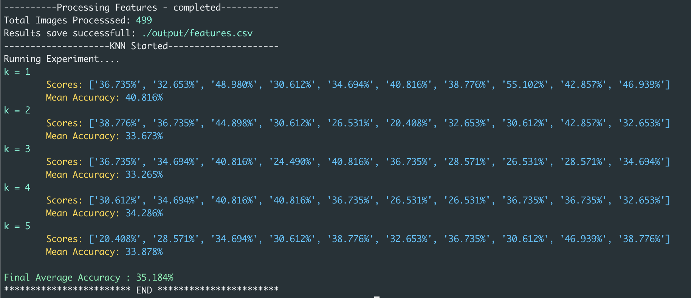

# Image Analysis - Part3

## Overview


The program's objective is to classify the images to their cell-appropriate types (cyl, inter, let, mod, para, super, or svar). Below are the series of steps performed on the images 
* Take cell images as input. 
* Extract Features and save them to CSV file
* Load the CSV feature file data for k nearest neighbor
* Execute k-nearest neighbor on the loaded dataset with k-fold cross-validation, outputting the accuracy of cross-validation
* A TOML file for configuration of attributes input, output, k-bound, and number of folds

The operations are performed with ```numpy``` and do not use any existing third-party library implementations.

## Usage

```
git clone https://github.com/praveenarallabandi/ImageFeatures.git
cd ImageFeatures
pip3 install --user pipenv
python ImageAnalysisPart3.py
```

## Implementation

### Feature Extraction 

The feature extracted from images are
* ```Area of the cluster``` - The area of the image by calculating pixels of a cluster on the morphologically opened image
* ```Entropy of image``` - Probability of each image combined with a single scalar value
* ```Histogram Mean``` - Mean of the histogram on each of the occurrences of each pixel value
* ```Perimeter``` - The perimeter of the image by summation of the interior and external boundaries of the image 

The features are calculated for each image, then data is normalized and concatenated with label name as the last column and then saved to CSV file.

### K-Nearest Neighbour
The testing is executed with k-fold(default to 10) cross-validation. The dataset is split into k folds (10 folds) and tested for each fold explicitly. For each fold, the training data set is rendered to knn to determine the predicted label and tested label against the testing portion of the fold. In a nutshell, for each test instance.

* Compute the distance consistently of every training instance using ```euclidean distance```
* select the closest k instances and their frequent labeled class as predicted for the test row

## Dependencies 

* NumPy - For Array operations
* Toml - Configuration settings
* PIL (Image) - Used only for importing and exporting images

## Results

Below is a sample of the results reported from the cross-fold validation for different values of k. The results obtained on the dataset seemed to indicate that the features extracted from the images were not distinguishable enough to classify the cells as their respective type. Test on more values of k did not seem to improve the results of the classification. 

* The range for the mean accuracies between k values around 5% to 25% with total average accuracy at 17% for ```21``` images 



* The range for the mean accuracies between k values around 33% to 40% with total average accuracy at 35% for ```499``` images

